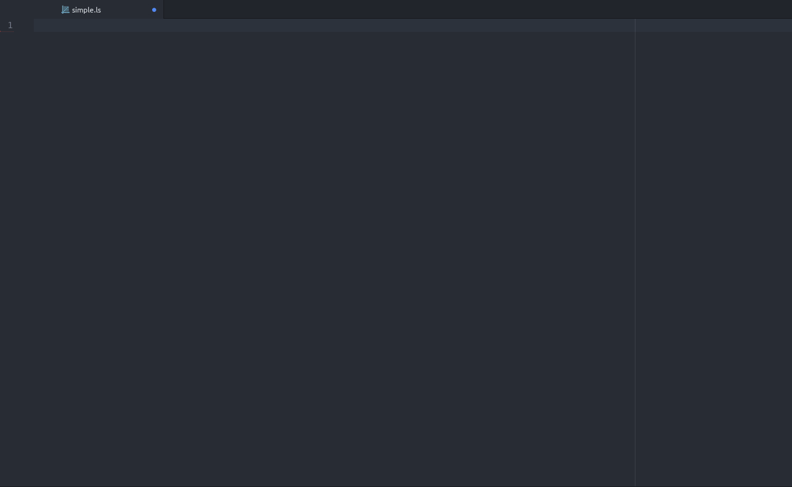

# Preview for LiveScript IDE
This Atom package will allow realtime preview of transpiled/rendered/transformed files. Inspired by MarkdownPreview and SourcePreview packages.

It is part of LiveScript IDE project, still very WIP and **requires** [ide-livescript](https://atom.io/packages/ide-livescript) package.

Support for esm dialect of livescript through [livescript-transform-esm](https://www.npmjs.com/package/livescript-transform-esm)

# License 
**[BSD-3-Clause](License.md)**
